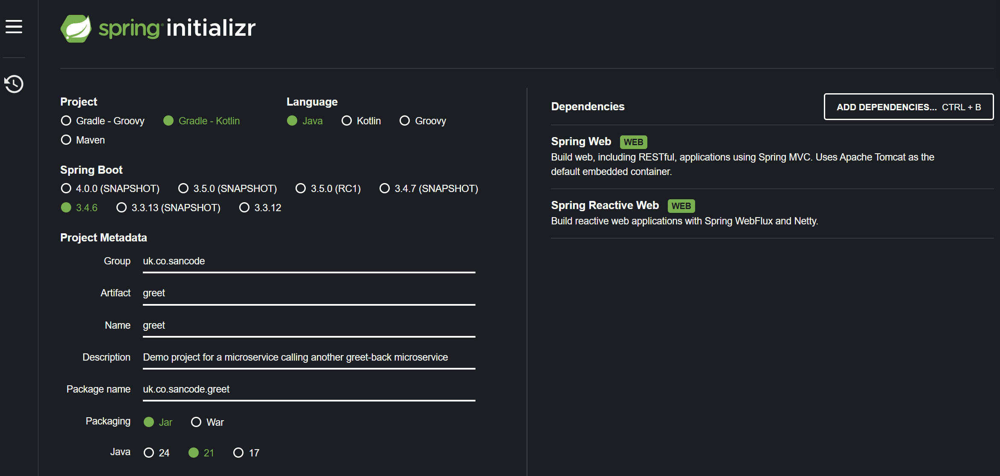

# greet

Spring Boot microservice that demonstrates implementing the following:

- Restful web service
- Microservice interactions with WebClient (interacting with `greet-back`)
- Integration tests
- Custom JUnit Assertions
- Wiremock usage
- Docker compose


*(Spring boot initializer)*

## Prerequisites

Before you begin, ensure you have the following installed:
- Java JDK (e.g., JDK 21 or later)
- Docker (if building/running Docker images)

## Developer Setup

### Running Tests
To run the test suite:
```
gradlew check
```

### Building docker images
```
gradlew check bootBuildImage
```
This will build a docker image for the Spring Boot application.

## Running the application
Either use `gradlew bootRun` or run the class `GreetApplication`
You will need to run `greet-back` application as well, so that `greet` can make rest calls to `greet-back`.

### Environment Variables
The following environment variables need to be set to run the application:

#### greet-back Configuration
*   `GREET_BACK_URL`: The full base URL for the `greet-back` service's endpoint.
    *   Example: `http://localhost:8081/greet-back`